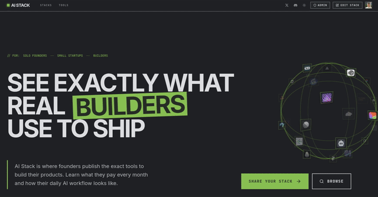

# AI Stack

<div align="center">

[](https://aistack.to)

**A curated platform for discovering, comparing, and sharing AI technology stacks**

[](https://aistack.to)

[](https://opensource.org/licenses/MIT)
[](https://www.typescriptlang.org/)
[](https://reactjs.org/)
[](https://tailwindcss.com/)

</div>

## 🎯 Purpose

AI Stack is a web application designed to help developers and teams discover, compare, and share AI technology stacks. Whether you're building a new AI-powered application or looking to optimize your existing stack, AI Stack provides a curated collection of tools, frameworks, and libraries to make informed decisions.

## ✨ Features

- **Discover** AI tools and frameworks organized by stack
- **Compare** different stacks side by side and cut costs for your own usage
- **Share** your own AI stacks with the community
- **Add Missing Tools** inline during stack creation or in batch mode
- **Stay Updated** with the latest AI technology trends
- **Authentication** via email/password and Google SSO

## 🛠 Tech Stack

### Frontend
- **Framework**: [TanStack Start](https://tanstack.com/start) - Full-stack React framework
- **UI Library**: [React 19](https://react.dev/) - Latest React with concurrent features
- **Styling**: [Tailwind CSS v4](https://tailwindcss.com/) - Utility-first CSS framework
- **Icons**: [Lucide React](https://lucide.dev/) - Beautiful & consistent icons
- **Animations**: [Motion](https://motion.dev/) & [GSAP](https://greensock.com/gsap/) - Smooth animations
- **Components**: [Radix UI](https://www.radix-ui.com/) - Accessible component primitives

### Backend & Data
- **Backend**: [Convex](https://convex.dev/) - Serverless database and backend functions
- **Authentication**: [Better Auth](https://better-auth.com/) - Modern authentication solution
- **State Management**: [TanStack Query](https://tanstack.com/query) - Server state management
- **Forms**: [TanStack Forms](https://tanstack.com/form) - Type-safe form handling

### Development Tools
- **Language**: [TypeScript](https://www.typescriptlang.org/) - Type-safe JavaScript
- **Build Tool**: [Vite](https://vitejs.dev/) - Fast build tool and dev server
- **Package Manager**: [pnpm](https://pnpm.io/) - Fast, disk space efficient package manager
- **Linting/Formatting**: [Biome](https://biomejs.dev/) - All-in-one toolchain
- **Testing**: [Vitest](https://vitest.dev/) - Fast unit testing framework

### Analytics
- **Analytics**: [PostHog](https://posthog.com/) - Product analytics suite

## 📁 Project Structure

```
aistack/              # Main web application
├── convex/           # Convex backend functions & schema
├── public/           # Static assets
├── src/              # React application source
│   ├── components/   # Shared UI primitives and cross-feature components
│   ├── features/     # Feature-scoped modules (landing, stack-editor, etc.)
│   ├── integrations/ # Third-party integrations
│   └── routes/       # File-based routing
└── README.md         # You are here
```

### Frontend Architecture Notes

- Route files should stay composition-focused (data fetch + section orchestration).
- Landing page is organized under `src/features/landing/*`.
- Stack editor is organized under `src/features/stack-editor/*` with:
  - section components in `sections/*`
  - reducer/selectors/hooks in `state/*`
  - status computation in `editor-status.ts`
- Reusable visual wrappers live under `src/components/system/*`.

## 🚀 Getting Started

### Prerequisites

- **Node.js** (v18 or higher)
- **pnpm** (recommended) or npm
- **Git**

### Installation

1. **Clone the repository**
   ```bash
   git clone https://github.com/alp82/aistack.git
   cd aistack
   ```

2. **Install dependencies**
   ```bash
   pnpm install
   ```

3. **Set up environment variables**
   ```bash
   # Copy the example environment file
   cp .env.example .env.local
   
   # Configure your environment variables
   # VITE_CONVEX_URL and CONVEX_DEPLOYMENT are required
   ```

4. **Initialize Convex**
   ```bash
   pnpm convex dev
   ```
   This will automatically set up your Convex deployment and update your environment variables.

5. **Start the development server**
   ```bash
   pnpm dev
   ```

   The application will be available at:
   - Frontend: http://localhost:3019
   - Convex Dashboard: http://localhost:3210

## 📜 Available Scripts

```bash
# Development
pnpm dev          # Start development server
pnpm convex dev   # Start Convex backend server

# Building
pnpm build        # Build for production
pnpm preview      # Preview production build

# Code Quality
pnpm lint         # Run Biome linter
pnpm format       # Format code with Biome
pnpm check        # Run all Biome checks

# Testing
pnpm test         # Run unit tests with Vitest
```

## 🧪 Testing

The project uses [Vitest](https://vitest.dev/) for unit testing. Tests are located in the `src/**/__tests__` directories.

Vitest is configured in `vite.config.ts` with:

- `test.environment = "jsdom"`
- `test.setupFiles = ["./src/test/setup.ts"]`

`src/test/setup.ts` loads `@testing-library/jest-dom/vitest` matchers for DOM assertions.

```bash
# Run all tests
pnpm test

# Run a single test file
pnpm vitest run src/features/stack-editor/state/__tests__/editor-reducer.test.ts

# Run tests in watch mode
pnpm test --watch

# Generate coverage report
pnpm test --coverage
```

## 🎨 Adding Components

This project uses [Shadcn UI](https://ui.shadcn.com/) components. Add new components with:

```bash
pnpm dlx shadcn@latest add [component-name]
```

## 📊 Development Notes

- The development server runs on `http://localhost:3019`
- The Convex backend runs on `http://localhost:3210`
- Both servers should remain running during development
- Use Chrome DevTools MCP for debugging and reviewing code updates
- **Dev Admin Access**: In development mode, a "Dev Admin Login" button appears on the login page. It signs in as `dev-admin@example.com` with admin privileges. This requires the Convex env var `IS_DEV=true` to be set (email verification is also skipped when `IS_DEV=true`)

## Database Migrations

Migration scripts are located in `convex/migrations/`. Run them via the Convex Dashboard or CLI.

### Running Migrations via Convex Dashboard

1. Open your Convex Dashboard at https://dashboard.convex.dev
2. Navigate to your project → **Functions** tab
3. Find the migration function under `migrations/`
4. Click on the function and use **Run Function** to execute it

### Running Migrations via CLI

```bash
# Run an internal query (read-only, for previews)
npx convex run migrations/backup:exportStackDescriptions

# Run an internal mutation (makes changes)
npx convex run migrations/populateShortIds:populateAllShortIds
```

### Available Migration Scripts

#### `migrations/backup.ts` - Backup & Restore

| Function | Type | Description |
|----------|------|-------------|
| `exportStackDescriptions` | Query | Export all stack descriptions as JSON backup |
| `exportShortIdMappings` | Query | Export tool/model/bundle shortId mappings |
| `restoreStackDescription` | Mutation | Restore a single stack from backup |
| `restoreStackDescriptionsBatch` | Mutation | Restore multiple stacks from backup array |

#### `migrations/populateShortIds.ts` - ShortId Population

| Function | Type | Description |
|----------|------|-------------|
| `getMissingCounts` | Query | Check how many records are missing shortId |
| `populateAllShortIds` | Mutation | Populate shortIds for all tools, models, bundles |
| `populateToolShortIds` | Mutation | Populate shortIds for tools only |
| `populateModelShortIds` | Mutation | Populate shortIds for models only |
| `populateBundleShortIds` | Mutation | Populate shortIds for bundles only |

#### `migrations/migrateStackDescriptions.ts` - Description Migration

| Function | Type | Description |
|----------|------|-------------|
| `getStackCounts` | Query | Count stacks with legacy blocks (iconurl attributes) |
| `dryRunMigration` | Query | Preview what would be migrated without changes |
| `previewStackMigration` | Query | Preview migration for a single stack |
| `migrateAllStackDescriptions` | Mutation | Run the actual migration on all stacks |

### Migration Workflow

**Before running migrations on production, always create a backup first!**

```bash
# Step 1: Backup existing stack descriptions
npx convex run migrations/backup:exportStackDescriptions > backup-stacks.json

# Step 2: Check how many records need shortId population
npx convex run migrations/populateShortIds:getMissingCounts

# Step 3: Populate shortIds for tools, models, and bundles
npx convex run migrations/populateShortIds:populateAllShortIds

# Step 4: Preview description migration (dry run)
npx convex run migrations/migrateStackDescriptions:dryRunMigration

# Step 5: Run the actual description migration
npx convex run migrations/migrateStackDescriptions:migrateAllStackDescriptions
```

### Restoring from Backup

If something goes wrong, restore from your backup:

```bash
# For a single stack
npx convex run migrations/backup:restoreStackDescription \
  '{"stackId": "k1234...", "description": "<p>Original content...</p>"}'

# For multiple stacks (pass JSON array)
npx convex run migrations/backup:restoreStackDescriptionsBatch \
  '{"backups": [{"stackId": "k1234...", "description": "..."}]}'
```

## 🤝 Contributing

Contributions are welcome! Please read our contributing guidelines and submit pull requests to the main branch.

1. Fork the repository
2. Create your feature branch (`git checkout -b feature/amazing-feature`)
3. Commit your changes (`git commit -m 'Add some amazing feature'`)
4. Push to the branch (`git push origin feature/amazing-feature`)
5. Open a Pull Request

## 📄 License

This project is licensed under the MIT License - see the [LICENSE](LICENSE) file for details.

## 🔗 Links

- [TanStack Documentation](https://tanstack.com)
- [Convex Documentation](https://docs.convex.dev)
- [Tailwind CSS](https://tailwindcss.com/docs)
- [Better Auth](https://better-auth.com/docs)

## 📞 Support

If you have any questions or need help, please open an issue on GitHub.

---

<div align="center">
Made with ❤️ by Alper Ortac: https://x.com/alperortac
</div>
