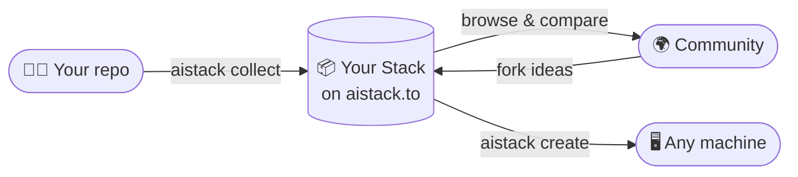

<div align="center">


# AI Stack

### Discover, compare, and share AI technology stacks

[](https://aistack.to)
[](https://www.npmjs.com/package/@use-aistack/cli)


<br>

### **Improve your AI workflow**

<br>

[](https://aistack.to)

<br>

[](https://discord.gg/5y4fpyahaF)
[](https://www.reddit.com/r/aistackcommunity/)

</div>

## 🎯 What is AI Stack

AI Stack helps developers and teams **discover, compare, and share AI technology stacks**. Whether you are building a new AI-powered application or optimizing an existing setup, AI Stack is a curated collection of tools, frameworks, and configs that lets you make informed decisions - and carry your own AI config between machines with one command.

## ✨ Features

- 🔍 **Discover** AI tools and frameworks organized by stack
- ⚖️ **Compare** stacks side by side and cut costs for your own usage
- 🚀 **Share** your own AI stacks with the community
- ➕ **Add missing tools** inline during stack creation or in batch mode
- 🔄 **Sync configs** between your repo and the web with the CLI
- 🔐 **Authentication** via email/password and Google SSO

## ⚙️ How It Works

AI Stack has two surfaces that work together: the **web app** where you browse and publish, and the **CLI** that bridges your local filesystem with your stack.



1. **The web app** ([aistack.to](https://aistack.to)) - where you browse stacks, compare tools, and publish your own setups. Each stack groups multiple **projects**, and each project holds your actual AI config files (prompts, rules, skills, MCP servers).

2. **The CLI** (`@use-aistack/cli`) - a small tool that scans your project for AI config files and uploads them, or clones someone else's configs into your working directory. No manual copy-paste.

**Typical flow:**

- Sign up on the web app and create a stack.
- Run `npx @use-aistack/cli collect` inside your repo to upload your `.cursorrules`, `CLAUDE.md`, `AGENTS.md`, skills, and MCP configs to your stack.
- Share the stack link. On another machine, run `npx @use-aistack/cli create` to write that AI setup into the current directory.

## 💻 CLI

The CLI is published to npm as [`@use-aistack/cli`](https://www.npmjs.com/package/@use-aistack/cli). Run it on demand with `npx` - no install required:

```sh
npx @use-aistack/cli <command>
```

| Command | What it does |
|---------|--------------|
| `login` | Authenticate with your AI Stack account via browser |
| `collect` | Scan the current project for AI config files and upload them to your stack |
| `create` | Write your stack's AI config files into the current directory |

`collect` detects: `.cursorrules`, `CLAUDE.md`, `AGENTS.md`, `.cursor/rules/`, `mcp.json`, skill directories, prompts, and global configs (`~/.claude/`, `~/.cursor/`, etc).

**Install globally (optional)** - if you would rather type `aistack` than `npx @use-aistack/cli` every time:

```sh
npm i -g @use-aistack/cli
# then: aistack login · aistack collect · aistack create
```

---

<div align="center">

# 🛠 Contributing

The rest of this document is for contributors working on the AI Stack web app or CLI.

</div>

## Tech Stack

<p align="center">
  
  
  
  
  
  
  
  
  
  
  
</p>

### Frontend
- **Framework**: [TanStack Start](https://tanstack.com/start) - full-stack React framework
- **UI Library**: [React 19](https://react.dev/) - latest React with concurrent features
- **Styling**: [Tailwind CSS v4](https://tailwindcss.com/) - utility-first CSS framework
- **Icons**: [Lucide React](https://lucide.dev/) - beautiful & consistent icons
- **Animations**: [Motion](https://motion.dev/) & [GSAP](https://greensock.com/gsap/) - smooth animations
- **Components**: [Radix UI](https://www.radix-ui.com/) - accessible component primitives

### Backend & Data
- **Backend**: [Convex](https://convex.dev/) - serverless database and backend functions
- **Authentication**: [Better Auth](https://better-auth.com/) - modern authentication solution
- **State Management**: [TanStack Query](https://tanstack.com/query) - server state management
- **Forms**: [TanStack Forms](https://tanstack.com/form) - type-safe form handling

### Development Tools
- **Language**: [TypeScript](https://www.typescriptlang.org/) - type-safe JavaScript
- **Build Tool**: [Vite](https://vitejs.dev/) - fast build tool and dev server
- **Package Manager**: [pnpm](https://pnpm.io/) - fast, disk-space-efficient package manager
- **Linting/Formatting**: [Biome](https://biomejs.dev/) - all-in-one toolchain
- **Testing**: [Vitest](https://vitest.dev/) - fast unit testing framework
- **Analytics**: [PostHog](https://posthog.com/) - product analytics suite

## 📁 Project Structure

```
aistack/              # Main web application
├── convex/           # Convex backend functions & schema
├── public/           # Static assets
├── src/              # React application source
│   ├── components/   # Shared UI primitives and cross-feature components
│   ├── features/     # Feature-scoped modules (landing, stack-editor, etc.)
│   ├── integrations/ # Third-party integrations
│   └── routes/       # File-based routing
└── README.md         # You are here
```

**Frontend architecture notes**

- Route files should stay composition-focused (data fetch + section orchestration).
- Landing page is organized under `src/features/landing/*`.
- Stack editor is organized under `src/features/stack-editor/*` with section components in `sections/*`, reducer/selectors/hooks in `state/*`, and status computation in `editor-status.ts`.
- Reusable visual wrappers live under `src/components/system/*`.

## 🚀 Getting Started

### Prerequisites

- **Node.js** (v18 or higher)
- **pnpm** (recommended) or npm
- **Git**

### Installation

```bash
# 1. Clone the repository
git clone https://github.com/alp82/aistack.git
cd aistack

# 2. Install dependencies
pnpm install

# 3. Set up environment variables
cp .env.example .env.local
# VITE_CONVEX_URL and CONVEX_DEPLOYMENT are required

# 4. Initialize Convex (sets up your deployment + env vars)
pnpm convex dev

# 5. Start the development server
pnpm dev
```

The application will be available at:

- **Frontend**: http://localhost:3019
- **Convex Dashboard**: http://localhost:3210

## 📜 Available Scripts

```bash
# Development
pnpm dev          # Start development server
pnpm convex dev   # Start Convex backend server

# Building
pnpm build        # Build for production
pnpm preview      # Preview production build

# Code Quality
pnpm lint         # Run Biome linter
pnpm format       # Format code with Biome
pnpm check        # Run all Biome checks

# Testing
pnpm test         # Run unit tests with Vitest
```

## 🧪 Testing

The project uses [Vitest](https://vitest.dev/) for unit testing. Tests live in `src/**/__tests__` directories.

Vitest is configured in `vite.config.ts` with `test.environment = "jsdom"` and `test.setupFiles = ["./src/test/setup.ts"]`. `src/test/setup.ts` loads `@testing-library/jest-dom/vitest` matchers for DOM assertions.

```bash
# Run all tests
pnpm test

# Run a single test file
pnpm vitest run src/features/stack-editor/state/__tests__/editor-reducer.test.ts

# Watch mode
pnpm test --watch

# Coverage report
pnpm test --coverage
```

## 🎨 Adding Components

This project uses [Shadcn UI](https://ui.shadcn.com/) components. Add new components with:

```bash
pnpm dlx shadcn@latest add [component-name]
```

> **Design note:** No border-radius (sharp corners throughout), monospace fonts for buttons/labels/technical accents, and **lime** as the brand color.

## 📊 Development Notes

- The development server runs on `http://localhost:3019`; the Convex backend on `http://localhost:3210`. Both should stay running during development.
- Use Chrome DevTools MCP for debugging and reviewing code updates.
- **Dev Admin Access**: in development mode, a "Dev Admin Login" button appears on the login page. It signs in as `dev-admin@example.com` with admin privileges. Requires the Convex env var `IS_DEV=true` (email verification is also skipped when `IS_DEV=true`).

## 🗄 Database Migrations

Migration scripts live in `convex/migrations/`. Run them via the Convex Dashboard (**Functions** tab → pick the function → **Run Function**) or the CLI:

```bash
# Run an internal query (read-only, for previews)
npx convex run migrations/backup:exportStackDescriptions

# Run an internal mutation (makes changes)
npx convex run migrations/populateShortIds:populateAllShortIds
```

### Available migration scripts

**`migrations/backup.ts`** - Backup & Restore

| Function | Type | Description |
|----------|------|-------------|
| `exportStackDescriptions` | Query | Export all stack descriptions as JSON backup |
| `exportShortIdMappings` | Query | Export tool/model/bundle shortId mappings |
| `restoreStackDescription` | Mutation | Restore a single stack from backup |
| `restoreStackDescriptionsBatch` | Mutation | Restore multiple stacks from a backup array |

**`migrations/populateShortIds.ts`** - ShortId Population

| Function | Type | Description |
|----------|------|-------------|
| `getMissingCounts` | Query | Check how many records are missing a shortId |
| `populateAllShortIds` | Mutation | Populate shortIds for all tools, models, bundles |
| `populateToolShortIds` | Mutation | Populate shortIds for tools only |
| `populateModelShortIds` | Mutation | Populate shortIds for models only |
| `populateBundleShortIds` | Mutation | Populate shortIds for bundles only |

**`migrations/migrateStackDescriptions.ts`** - Description Migration

| Function | Type | Description |
|----------|------|-------------|
| `getStackCounts` | Query | Count stacks with legacy blocks (iconUrl attributes) |
| `dryRunMigration` | Query | Preview what would be migrated without changes |
| `previewStackMigration` | Query | Preview migration for a single stack |
| `migrateAllStackDescriptions` | Mutation | Run the actual migration on all stacks |

### Migration workflow

> ⚠️ **Before running migrations on production, always create a backup first.**

```bash
# 1. Backup existing stack descriptions
npx convex run migrations/backup:exportStackDescriptions > backup-stacks.json

# 2. Check how many records need shortId population
npx convex run migrations/populateShortIds:getMissingCounts

# 3. Populate shortIds for tools, models, and bundles
npx convex run migrations/populateShortIds:populateAllShortIds

# 4. Preview description migration (dry run)
npx convex run migrations/migrateStackDescriptions:dryRunMigration

# 5. Run the actual description migration
npx convex run migrations/migrateStackDescriptions:migrateAllStackDescriptions
```

**Restoring from backup**

```bash
# Single stack
npx convex run migrations/backup:restoreStackDescription \
  '{"stackId": "k1234...", "description": "<p>Original content...</p>"}'

# Multiple stacks (pass a JSON array)
npx convex run migrations/backup:restoreStackDescriptionsBatch \
  '{"backups": [{"stackId": "k1234...", "description": "..."}]}'
```

## 🤝 How to Contribute

Contributions are welcome.

1. Fork the repository
2. Create your feature branch (`git checkout -b feature/amazing-feature`)
3. Commit your changes (`git commit -m 'Add some amazing feature'`)
4. Push to the branch (`git push origin feature/amazing-feature`)
5. Open a Pull Request against `main`

## 📄 License

Licensed under the MIT License - see the [LICENSE](LICENSE) file for details.

## 🔗 Links

- [TanStack Documentation](https://tanstack.com)
- [Convex Documentation](https://docs.convex.dev)
- [Tailwind CSS](https://tailwindcss.com/docs)
- [Better Auth](https://better-auth.com/docs)

---

<div align="center">

**Built with 💚 by Alper Ortac** &middot; [x.com/alperortac](https://x.com/alperortac)

[](https://aistack.to)

</div>
